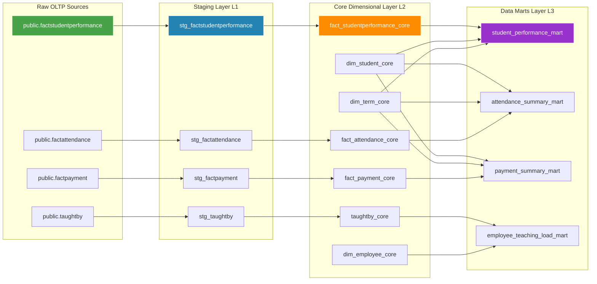

# 📚 School Data Warehouse for Management Analytics

An enterprise-grade, dimensionally modeled Analytical Data Warehouse designed to centralize, transform, and aggregate operational metrics for a secondary educational institution. This platform implements a robust Kimball Star Schema architecture within a PostgreSQL database layer, fully orchestrated and transformed using **dbt (Data Build Tool)** to deliver optimized Data Mart layers for management tracking.

---

## 🏗️ Core Architectural Design & dbt Data Lineage

The data warehouse enforces a rigorous three-tier modern data stack topology: **Staging (stg_)** for schema normalization, **Core (Intermediate)** for Kimball dimensional star-schema modeling, and **Marts** for denormalized, analytics-ready reporting.



## Key Data Modeling & dbt Implementations
* **Granular Multi-Fact Architecture:** Decoupled operational spaces into isolated, modular pipelines (Performance, Attendance, Payments) within dbt to ensure strict grain independence and prevent fan-out multiplication errors during downstream aggregations.

* **Conformed Dimension Sharing:** Modeled core entity keys (dim_student_core, dim_term_core) as centralized, reusable dimensions that seamlessly intersect to power multiple distinct downstream data marts.

* **Many-to-Many Bridge Analytics:** Resolved complex course assignments through an intermediate bridge schema layer (taughtby_core), directly generating a specialized Employee Teaching Load Mart to measure staff output boundaries without data duplication.

* **Production T-Layer Abstraction:** Explicitly isolated raw tables into immutable source files, utilizing dbt ref functions to guarantee strict dependency ordering, modular dry-runs, and zero-loss query transformations.

## 📁 Repository Structure
```Plaintext
├── Diagrams/                  # Production Modeling, Lineage, & Validation Maps
│   ├── SchoolProject_ERD.jpg                   # Conceptual Entity Relationship Map
│   ├── SchoolProject_RelationalModelDiagram.png # Logical relational constraint layout
│   ├── Project_dbtGraph.png                    # Global dbt Lineage Directed Acyclic Graph (DAG)
│   ├── dbt_run.png                             # Proof of successful model compilation execution
│   ├── dbt_test.png                            # Captured data quality & schema assertion validation runs
│   ├── dbt Webserver.png                       # Active documentation web UI lineage check
│   ├── Tables_data.png                         # Verified warehouse storage layer output
│   └── *_graph.png                             # Isolated individual downstream mart sub-graphs
├── logs/                      # System telemetry and build logs
├── PythondataScript/          # Mock data ingestion engines and pipeline scripts
├── SQL/                       # Production DDL Deployment Configurations
│   └── data_warehouse_schema.sql # Core PostgreSQL Warehouse Schema definition
└── README.md                  # System Documentation Matrix
```

## Database Schema & Deployment Matrix
The analytical warehouse is built for native deployment across PostgreSQL 15+ environments.

1. Initialize the Target Analytical Database
Ensure your local PostgreSQL instance is running, then create your targeted processing environment:

```SQL
CREATE DATABASE school_data_warehouse;
```
2. Deploy Core Tables, Constraints, and Analytical Indexes
Execute the standardized DDL blueprint to build the complete table space structure, keys, and foreign relational bindings:

```Bash
psql -U your_postgres_user -d school_data_warehouse -f SQL/data_warehouse_schema.sql
```

3. Execute dbt Analytics Mart Build Sequences
To compile models, execute data test suits, and spin up the completely transformed analytical data marts layer, run:

```Bash
dbt clean && dbt compile
dbt build
```
## Analytical Mart Query Capabilities
The decoupled staging-to-mart structure drastically accelerates analytical reporting. The following production-ready query showcases how easy it is to draw performance insights directly from the refined data marts:

### Metric Sample: Computing Cumulative Grade Point Average (CGPA)
```SQL
SELECT 
    student_id,
    student_full_name,
    term_name,
    ROUND(AVG(terminal_gpa), 2) AS cumulative_cgpa
FROM student_performance_mart
GROUP BY student_id, student_full_name, term_name
ORDER BY cumulative_cgpa DESC;
```
## Technology Stack & Tooling
**Storage Engine:** PostgreSQL (Analytical Core Infrastructure Layer)

**Data Transformation Layer:** dbt (Data Build Tool Core v1.7+)

**System Modeling & Vector Layouts:** Draw.io & DBdiagram.io

**Version Management:** Git & GitHub Engine

---

## Quality Assurance & Continuous Testing

Data transformations, structural constraints, primary key uniqueness, and non-null values are systematically tested using dbt's native test suites. 

* **Schema Assertions:** Validated via automated test runs (`dbt test`) to verify relational integrity before data enters downstream reporting layers.
* **Telemetry Proof:** Step-by-step compilation metrics, error handling, and test confirmations are captured and archived locally inside the `/Diagrams` directory (`dbt_run.png`, `dbt_test.png`).